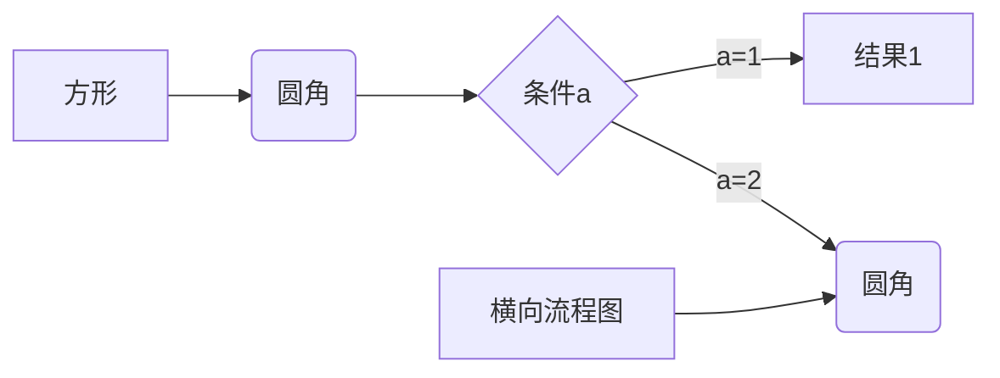

[TOC]
___
# MARKDOWN 
____
## 字体
- - -  
> *斜体*   
_斜体_  
* * *  
> **粗体**  
__粗体__  
_ _ _  
> ***粗斜体***  
___粗斜体___  
***
> ~~删除线~~  
***  
> <u>带下划线的文本</u>  
***  
## 字体颜色
> <font face="黑体">我是黑体字</font>
<font face="微软雅黑">我是微软雅黑</font>
<font face="STCAIYUN">我是华文彩云</font>
<font color=red>我是红色</font>
<font color=#008000>我是绿色</font>
<font color=Blue>我是蓝色</font>
<font color=Blue size=5>我是尺寸</font>
<font face="黑体" color=green size=5>我是黑体，绿色，尺寸为5</font>
***  
## 脚注
创建脚注格式:  [^RUNOOB]  

[^RUNOOB]: 菜鸟教程 -- 学的不仅是技术，更是梦想！！！  
***  
## 列表

> * 第一项  
> * 第二项
> * 第三项 
> + 第一项  
> + 第二项  
> + 第三项
> - 第一项  
> - 第二项 
> - 第三项 
***  
## 分块
1. 第一项
   - 第一项子项
   > 区块start  
     区块end 

2. 第二项
   - 第二项子项
***  
## 函数   
>  `printf()`  
> ```javascript
>  $(document).ready(function () {
> alert('RUNOOB');
> });
>  ```
***  
## 链接  
> <a href="http://www.hisome.com" target="_blank">恒生数字</a>
***  

## 表格
| 左对齐 | 右对齐 | 居中对齐 |  
| :---- | ----: | :----: |  
| 单元格 | 单元格 | 单元格 |  
| 单元格 | 单元格 | 单元格 |  
***  

***  
## 背景颜色 [^背景]    
> [^背景]: 由于 style 标签和标签的 style 属性不被支持，所以这里只能是借助 table, tr, td 等表格标签的 bgcolor 属性来实现背景色。故这里对于文字背景色的设置，只是将那一整行看作一个表格，更改了那个格子的背景色（bgcolor） 
> <table><tr><td bgcolor=yellow>背景色yellow</td></tr></table>
***
<span id="jump">图片</span>
## 图片
<!-- >    -->
   
***  
## 设置图片大小
> ### 设置图片百分比
>   
> 
> ### 设置图片大小
>   
> <p>空白行</p>  
> <div>空白行</div>  
>dad <br/><br/>  dadsfd
> 
> ### 设置图片居中 [^位置]  
> [^位置]:center,left,left
> <div align=center></div>
> 
***
## 页内跳转
> [名称](#这是一级标题)
> <a href="#字体颜色">字体颜色</a>
> [首行](#这是一级标题)
> 
***
## 复选框
- [x] ds dasfd
- [x] dafdsafsa
***
[点击跳转](#jump)
***

***
